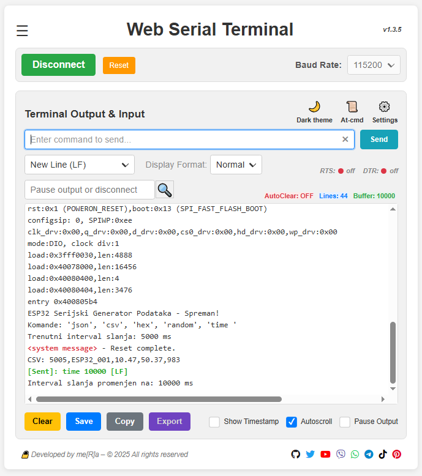
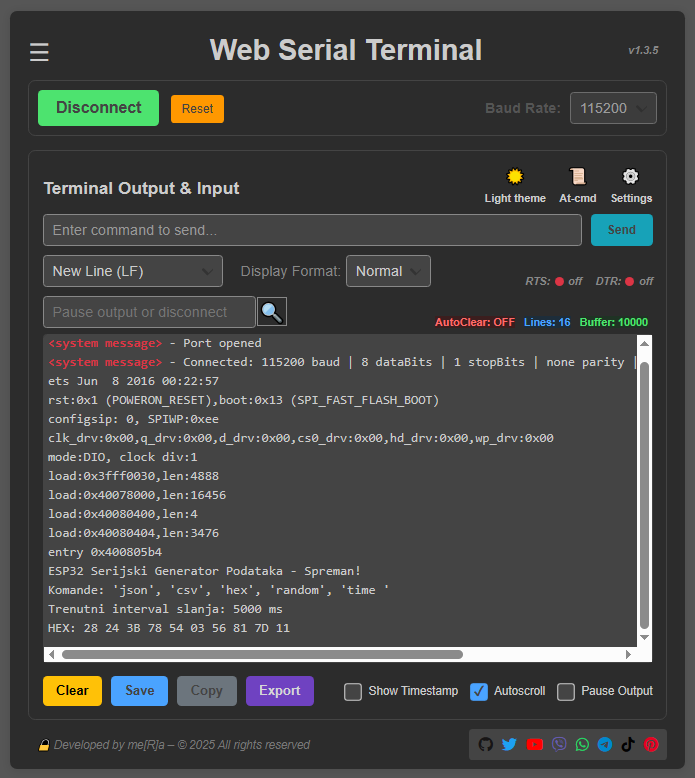
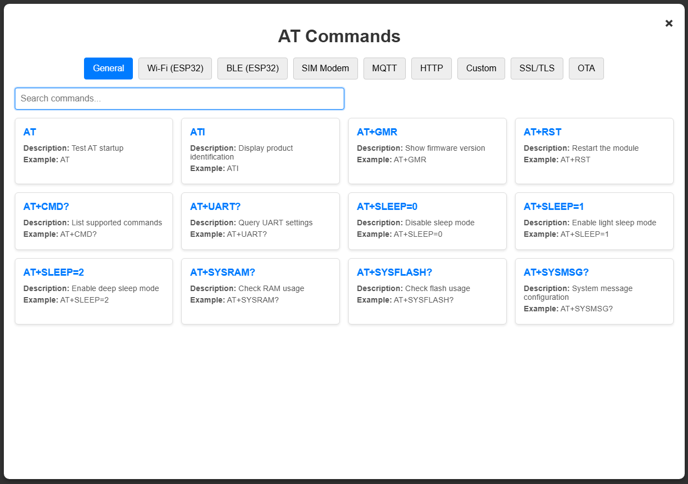
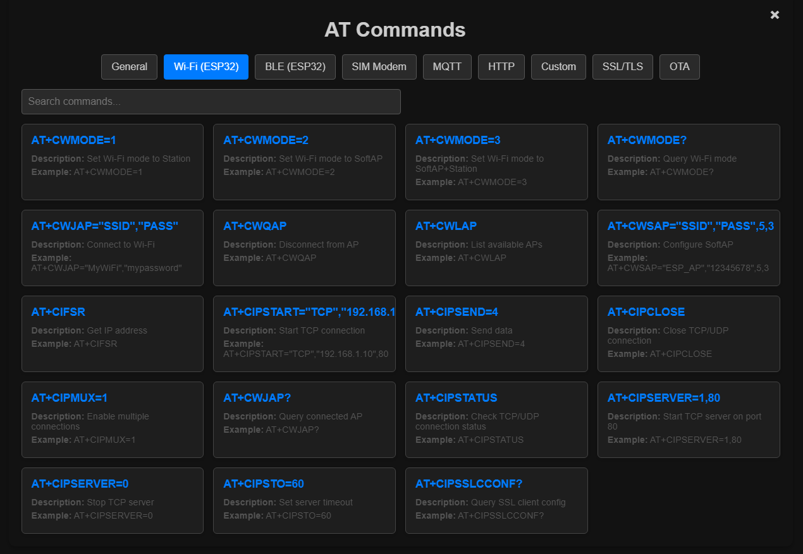

# Web Serial Terminal

[](https://github.com/YuMERA/serial-terminal)
[](https://github.com/YuMERA/serial-terminal/releases)
[](https://github.com/YuMERA/serial-terminal/issues)
[]()
[](https://serial-terminal-cyan.vercel.app/)

---

## 🌐 Live Demo
👉 [**Try it on Vercel**](https://serial-terminal-cyan.vercel.app/)

---

## 📑 Quick Links
- [Features](#-features)
- [Screenshots](#-screenshots)
- [Installation](#-installation)
- [Usage Guide](#-how-to-use)
- [Changelog](#-changelog)
- [License](#-license)
- [Project Structure](#-project-structure)

---

## 🚀 Features
✔ Serial Communication via **Web Serial API**  
✔ Connect / Disconnect with **dynamic baud rate**  
✔ **Hardware Reset** (RTS/DTR toggle)  
✔ Live Terminal:
✔ Timestamp (12h/24h)
✔ Normal / Hex / JSON display modes
✔ Auto-scroll & Auto-clear  
✔ Export Options: TXT, JSON, CSV  
✔ **Custom Settings** (baud, data bits, parity, RTS/DTR)  
✔ **Emergency Auto-Clear** at 12,000 lines  
✔ **Dark & Light Themes**  
✔ **AT Commands Library (NEW in v1.5.0)**:
✔ Full-screen modal with categorized tabs
✔ Dynamic JSON-based data (150+ commands)
✔ Search with highlight and quick clear
✔ Responsive layout (tabs on desktop, dropdown on mobile)
✔ PWA support for mobile (Add to Home Screen)  
✔ High-resolution icons for Android and iOS  
✔ Dynamic theme-color for better mobile UX  

---

## 🖼 Screenshots
### Main UI



### AT Commands Modal



---

## 🛠 Requirements
- Browser: **Chrome**, **Edge**, or any with Web Serial API
- HTTPS connection (required by Web Serial)
- USB device supporting serial communication (ESP32, Arduino, SIM Modem)

---

## 📜 Changelog
See full history in [CHANGELOG.md](./CHANGELOG.md)

---

## 🔑 How to Use
1. Open the app in a compatible browser
2. Click **Connect**, select your serial port
3. Set baud rate and other settings
4. Start sending and receiving data
5. Open **AT Commands modal** to quickly insert commands
6. Use **Reset** for hardware restart without disconnecting

---

## 📂 Project Structure

- serial-terminal/
- ├── index.html
- ├── site.webmanifest
- ├── assets/
- │   ├── css/
- │   │   ├── style.css
- │   │   └── menu.css
- │   ├── js/
- │   │   ├── script.js
- │   │   └── at-modal.js
- │   ├── json/
- │   │   ├── at_commands.json
- │   │   ├── features.json
- │   │   ├── info.json
- │   │   └── version.json
- │   └── img/
- │       ├── favicon.ico
- │       └── /icons/
- │           ├── icon-192.png
- │           ├── icon-512.png
- │           └── apple-touch-icon.png
- ├── CHANGELOG.md
- ├── README.md
- └── /screenshots/

---

## 🔒 License
© 2025 me[R]a — All rights reserved.

---

## ⚙ Installation
Clone the repo:
```bash
git clone https://github.com/YuMERA/serial-terminal.git
cd serial-terminal
